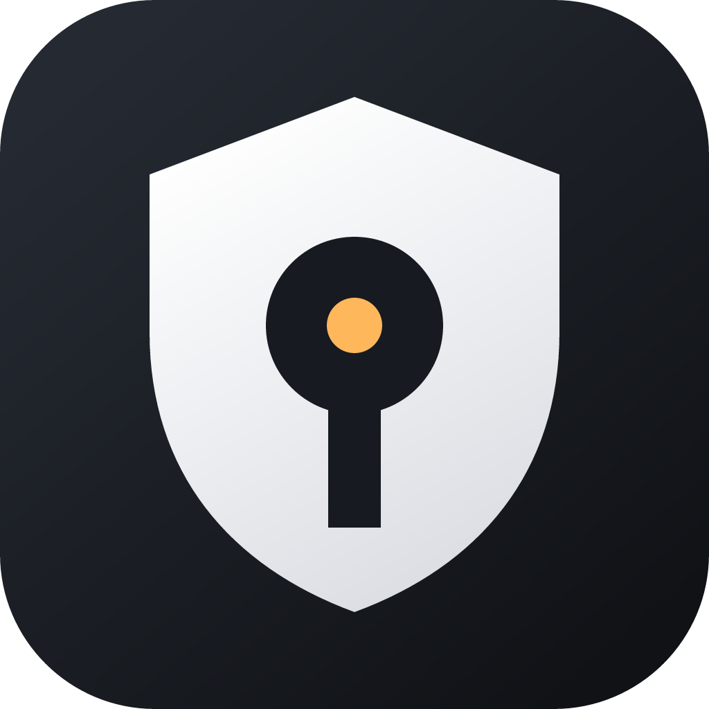

# OsaGuard

<div align="center">



**Русский** · [English](README.en.md)

[](#статус-распространения)
[](https://github.com/aiwaki/osaguard/actions/workflows/ci.yml)
[](LICENSE)

</div>

OsaGuard — экспериментальное приложение для строки меню macOS. Оно умеет
распознавать поддерживаемое системное окно пароля администратора, вызванное
AppleScript, и после явной настройки ввести и отправить сохранённый пароль.

## Статус распространения

OsaGuard выпускается как **Preview** через [GitHub Releases](https://github.com/aiwaki/osaguard/releases).
Текущая исправленная сборка — `v0.1.1-preview.1` для Apple Silicon и macOS 13+. Это
ручная предварительная установка, а не stable-канал.

У проекта нет Apple Developer Program, Developer ID или нотариального тикета
Apple. Поэтому preview подписан ad-hoc, не нотариально заверен и не обещает
сохранение разрешения Accessibility или непрерывность Связки ключей между
версиями. Встроенный updater для preview намеренно выключен: следующую
preview нужно скачать вручную со страницы Releases.

### Установка preview

1. Откройте [последний **Pre-release**](https://github.com/aiwaki/osaguard/releases).
2. Скачайте `OsaGuard_0.1.1_preview.1_aarch64.dmg` и перенесите приложение в
   «Программы».
3. Запускайте OsaGuard только из «Программ». Если macOS предупредит о
   ненотариальной preview-сборке, не отключайте Gatekeeper глобально: используйте
   контекстное меню Finder → «Открыть» только для этого exact preview, если вы ему
   доверяете.

Не устанавливайте файлы OsaGuard не со страницы проекта. Preview — не обещание
стабильности или совместимости с будущими stable-релизами.

## Прочитайте это до запуска

Автоматическое подтверждение OsaGuard убирает ручное действие, которое обычно
защищает административную операцию. После его включения **любая программа,
скрипт или вредоносное ПО, уже запущенное от вашего пользователя macOS, может
вызвать подходящее окно AppleScript, после чего OsaGuard может ввести и
отправить ваш пароль.** С точки зрения безопасности это может превратить
OsaGuard в способ получить root без пароля для кода, уже работающего от вашего
имени.

OsaGuard проверяет системный процесс авторизации Apple и отправляет нажатия
клавиш именно этому процессу, а не произвольному активному окну. Это уменьшает
риск случайного ввода и поддельных окон, но не делает автоматическое
подтверждение безопасным при наличии вредоносного кода в вашей учётной записи.

Есть и неизбежное ограничение причинной связи: публичные API Accessibility и
CGWindow в macOS показывают владельцем администраторского окна процесс
SecurityAgent, но не раскрывают и не связывают это окно с клиентом, запросившим
авторизацию. Поэтому OsaGuard использует только краткую приближённую временную
корреляцию, а не криптографически или системно доказанную связь. Если в том же
коротком временном интервале появится другое настоящее администраторское окно
SecurityAgent, OsaGuard может отправить сохранённый пароль в него.

Не используйте OsaGuard на общем, управляемом организацией или недоверенном Mac.
Сначала прочитайте [описание безопасности](docs/SECURITY_DESIGN.md).

## Для чего нужен OsaGuard

OsaGuard рассчитан на стандартное окно пароля администратора, которое создаёт
`/usr/bin/osascript` — обычно для AppleScript-команды
`with administrator privileges`. Он не привязан к конкретному приложению и не
является allowlist-ом операций.

Он **не** заполняет:

- экран входа или блокировки Mac;
- пароль FileVault, сайта, браузера или другого приложения;
- произвольные поля паролей;
- все виды системных окон авторизации macOS.

## Тестирование из исходников

Это раздел для разработчиков, а не инструкция по обычной установке. Нужны macOS
13+, Xcode Command Line Tools, Go 1.23+ с cgo, Rust 1.89 и актуальные Node.js с
npm, поддерживаемые Tauri 2.

```sh
make check
make tray-build
```

Локальный bundle появится в
`app-tauri/src-tauri/target/release/bundle/macos/`. Он подписан ad-hoc, не
нотариально заверен, не имеет стабильного канала обновлений и может получить
новую TCC-идентичность с каждой пересборкой. Устанавливайте его только для
контролируемой разработки; не храните в нём реальный пароль администратора без
понимания описанного выше риска и последствий очистки.

Для такой локальной проверки приложение должно находиться в «Программах», а
Accessibility выдаётся только именно этой сборке через **Системные настройки →
Конфиденциальность и безопасность → Универсальный доступ**. Если прежняя строка
OsaGuard не даёт доступа новой сборке, удалите старую строку, затем запросите и
включите доступ заново.

## Настройка и меню

Если запущена preview или локальная разработческая сборка, приложение объясняет три
одноразовых шага:

1. разрешить Accessibility для этой точной сборки;
2. сохранить пароль через нативное защищённое окно macOS;
3. явно принять предупреждение об автоматическом подтверждении.

Пароль остаётся в нативном мосте и Связке ключей: он не передаётся в WebView
Tauri, аргументы команд, переменные окружения, журналы или буфер обмена.
Отмена окна пароля — тихое штатное действие; существующий пароль не меняется.

В меню строки macOS находятся состояние, **Открыть OsaGuard…**, **Сохранить
пароль администратора…** или **Изменить сохранённый пароль…**,
**Приостановить/Возобновить**, **Проверить обновления…**, **Удалить OsaGuard…**
и **Завершить OsaGuard**. Приостановка прекращает автоматический ввод, но не
удаляет пароль. Удаление останавливает watcher, отключает запуск при входе,
удаляет проверенные объекты OsaGuard из Связки ключей и локальные настройки,
сбрасывает разрешение Accessibility и переносит приложение в Корзину.

Интерфейс выбирает русский при русском языке macOS; для остальных языков
используется английский.

## Обновления

В исходном коде реализованы Tauri updater, проверка через 15 секунд после
запуска и затем раз в шесть часов, системные уведомления и явное подтверждение
установки. Но публичная preview **не подключена к updater-каналу**:
GitHub `latest` не указывает на prerelease и был бы ненадёжным источником.

Поэтому preview показывает «Обновления недоступны в этой preview-сборке» — это
ожидаемое fail-closed поведение. Следующая preview пока устанавливается вручную
из Releases. Отдельный preview-канал с подписанным appcast появится только после
реальной проверки перехода одной preview в следующую.

## Конфиденциальность

В OsaGuard нет аккаунта, рекламы, аналитики, облачного хранения пароля и работы
с буфером обмена. Пароль и распознавание окна остаются на Mac. Подробности:
[Конфиденциальность](PRIVACY.md). Уязвимости отправляйте по инструкции в
[политике безопасности](SECURITY.md).

## Участие в проекте

Начните с [руководства для участников](CONTRIBUTING.md). Технические документы:
[карта документации](docs/README.md), [архитектура безопасности](docs/SECURITY_DESIGN.md),
[результаты квалификации](docs/QUALIFICATION.md) и
[release gate](docs/RELEASING.md).

OsaGuard распространяется по [лицензии MIT](LICENSE). Сторонние компоненты
сохраняют свои лицензии; см. [уведомления](THIRD_PARTY_NOTICES.md).
